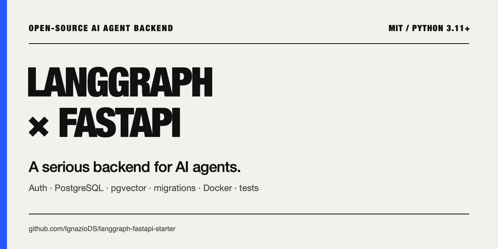
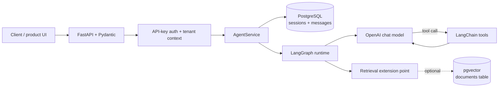

<div align="center">



# LangGraph FastAPI Starter

### Ship a real AI agent API — not another notebook demo.

A lean, open-source, production-shaped Python backend for **LangGraph agents** with **FastAPI**, **PostgreSQL + pgvector**, API-key auth, persistent conversations, Docker, migrations, and tests.

[](https://github.com/IgnazioDS/langgraph-fastapi-starter/actions/workflows/ci.yml)
[](https://github.com/IgnazioDS/langgraph-fastapi-starter/releases)
[](https://www.python.org/)
[](./LICENSE)
[](https://github.com/IgnazioDS/langgraph-fastapi-starter/stargazers)

[Quickstart](#quickstart) · [What you get](#what-you-get) · [Architecture](#architecture) · [Build your agent](#build-your-own-agent) · [API](#api-reference)

</div>

> Built for AI engineers turning a graph prototype into a durable REST API. Keep the backend plumbing, replace four small graph files, and focus on the behavior that makes your agent unique.

Use it as the starting point for a RAG assistant, internal copilot, support agent, research workflow, or AI SaaS backend.

## Why this starter exists

Most agent tutorials stop at `graph.invoke()`. Real products still need authentication, tenant isolation, conversation history, migrations, health checks, structured errors, logs, containers, and a testable service boundary.

This repository provides that missing backend layer without turning it into a framework:

- **Small enough to understand:** the agent lives in four focused files.
- **Serious enough to extend:** auth, persistence, migrations, logging, CI, and tests are already wired.
- **Deliberately boring infrastructure:** one PostgreSQL database, explicit SQL, and no hidden runtime magic.
- **Honest about scope:** no UI, billing, background queue, or observability vendor is forced on you.

## Quickstart

### 1. Clone and configure

```bash
git clone https://github.com/IgnazioDS/langgraph-fastapi-starter.git
cd langgraph-fastapi-starter
cp .env.example .env
```

Set the two required values in `.env`:

```dotenv
OPENAI_API_KEY=sk-...
POSTGRES_PASSWORD=localdev
```

### 2. Install and boot

```bash
make install
make up
make migrate
make create-key NAME="local-dev" ROLE="admin"
make dev
```

Save the API key printed by `make create-key`, then call the agent:

```bash
curl -X POST http://localhost:8000/v1/agent/run \
  -H "Authorization: Bearer <your-api-key>" \
  -H "Content-Type: application/json" \
  -d '{
    "session_id": "demo-1",
    "message": "What makes a reliable production AI agent?"
  }'
```

You now have an authenticated agent API with PostgreSQL-backed conversation history. Open [http://localhost:8000/docs](http://localhost:8000/docs) for the interactive OpenAPI UI.

For the shortest clone → customize → run → test path, follow [Build Your First Agent](./docs/build-your-first-agent.md).

## What you get

| Capability | Included implementation |
|---|---|
| Agent orchestration | Explicit LangGraph tool-calling loop with replaceable nodes, state, tools, and edges |
| API | Typed FastAPI routes, Pydantic v2 models, OpenAPI docs, and consistent error envelopes |
| Conversation memory | Tenant-aware sessions and message history persisted in PostgreSQL |
| RAG foundation | pgvector enabled in the first migration plus a document-retrieval extension point |
| Authentication | Revocable Bearer API keys, admin/user roles, tenant isolation, and hashed storage |
| Operations | Liveness/readiness endpoints, request IDs, structured JSON logs, Docker, and Gunicorn |
| Database changes | Reproducible Alembic migrations and parameterized SQL |
| Quality gates | pytest, Ruff, MyPy strict mode, and GitHub Actions CI |

### Intentionally not included

Redis, Celery, OAuth, JWT sessions, file storage, billing, feature flags, an admin UI, and a mandatory observability platform. Add the pieces your product proves it needs.

## Architecture



The request path stays explicit: FastAPI handles transport, middleware establishes identity, the service loads and saves conversation history, and LangGraph owns the agent loop. PostgreSQL remains the only required datastore.

## Build your own agent

You do not need to understand the entire repository before customizing it. Your agent's behavior is concentrated in four files:

| File | Change it to… |
|---|---|
| `app/graph/state.py` | define the state your workflow carries |
| `app/graph/nodes.py` | implement reasoning, retrieval, validation, or routing steps |
| `app/graph/tools.py` | expose your product APIs and data as tools |
| `app/graph/graph.py` | connect nodes, branches, tool loops, and finish conditions |

The included research assistant is intentionally small. Replace it with a support copilot, document analyst, operations agent, lead-qualification workflow, or any domain-specific graph.

## Good fit / not a fit

Choose this starter when you want:

- a Python agent backend your team can read in one sitting;
- LangGraph orchestration behind a conventional REST API;
- persistent multi-turn conversations without adding a second datastore;
- secure-by-default API access and an obvious path to multi-tenancy;
- infrastructure you can replace incrementally instead of framework lock-in.

Choose a larger platform when you already need:

- a visual workflow builder or hosted agent control plane;
- built-in distributed jobs, rate limiting, tracing dashboards, and model fallbacks;
- native multi-provider routing or a production UI out of the box;
- turnkey Kubernetes/Terraform infrastructure.

## Project structure

```text
langgraph-fastapi-starter/
├── app/
│   ├── main.py                  # App factory, lifespan, middleware, routers
│   ├── config.py                # Typed environment configuration
│   ├── graph/                   # ← YOUR AGENT LIVES HERE
│   │   ├── state.py             # Agent state shape
│   │   ├── nodes.py             # Graph node functions
│   │   ├── tools.py             # Agent tools and retrieval seam
│   │   └── graph.py             # Graph assembly and routing
│   ├── routers/                 # Agent, API-key, and health endpoints
│   ├── services/                # Agent execution and key management
│   ├── db/                      # Connection pool and parameterized queries
│   ├── middleware/              # Authentication and structured logging
│   └── models/                  # Pydantic request/response contracts
├── migrations/                  # Alembic schema history
├── scripts/                     # Key management and health utilities
├── tests/                       # Router, service, and graph tests
├── docs/build-your-first-agent.md
├── docker-compose.yml           # PostgreSQL + pgvector
├── Dockerfile                   # Production image
├── Makefile                     # Supported developer workflows
└── pyproject.toml
```

## API reference

### Run an agent

```http
POST /v1/agent/run
Authorization: Bearer <api-key>
Content-Type: application/json

{
  "session_id": "user-123-session-1",
  "message": "Summarize the latest context and recommend the next action."
}
```

```json
{
  "session_id": "user-123-session-1",
  "response": "Agent response text",
  "run_id": "run_20260402T143022000000",
  "usage": {
    "input_tokens": 142,
    "output_tokens": 87
  }
}
```

The endpoint currently returns a standard JSON response. Native SSE streaming is a roadmap item.

### Get session history

```http
GET /v1/agent/sessions/{session_id}
Authorization: Bearer <api-key>
```

### Create an API key

```http
POST /v1/keys
Authorization: Bearer <admin-key>
Content-Type: application/json

{
  "name": "production-app",
  "role": "user",
  "tenant_id": "customer-123"
}
```

The plaintext key is returned once. Store it securely; it cannot be recovered.

### Revoke an API key

```http
DELETE /v1/keys/{key_id}
Authorization: Bearer <admin-key>
```

### Health checks

```http
GET /health            # Public liveness probe
GET /health/detailed   # Authenticated database + graph readiness probe
```

## Database schema

The starter creates three application tables:

```sql
api_keys (
  id, key_hash, lookup_hash, name, tenant_id, role,
  created_at, last_used_at, revoked_at
)

agent_sessions (
  id, session_id, tenant_id, created_at, last_active_at, message_count
)

agent_messages (
  id, session_id, role, content, metadata, created_at
)
```

The initial migration also enables the pgvector extension. Add the document schema that fits your product when you are ready:

```bash
alembic revision -m "add_documents_table"
```

## Design decisions

### One datastore first

PostgreSQL stores application data, conversation history, API keys, and—when you add a document table—vectors. This keeps the local and early-production stack understandable. Add Redis or a dedicated vector database when measured constraints justify it.

### Explicit SQL over an ORM

The data model is small and the queries are visible. Parameterized SQL keeps behavior predictable and makes it easy to understand exactly what every request does.

### API-key auth as a replaceable boundary

Bearer keys work for service-to-service and early product use cases. The middleware is deliberately isolated so you can swap in JWT or OAuth without rewriting graph or service code.

### LangGraph for the agent loop

LangGraph makes state, conditional branches, and tool cycles visible. This starter persists conversation history in its service layer; it does not claim to configure a LangGraph checkpointer for you.

### Request-response before streaming

A synchronous JSON contract is easier to integrate, test, and operate. Add SSE when the product experience requires it rather than maintaining two response paths from day one.

### Migrations, never startup schema mutation

Alembic keeps schema changes explicit, reversible, and auditable. Application startup verifies dependencies but does not create tables behind your back.

### Structured logs from day one

JSON logs and request IDs work with common log platforms without forcing a vendor SDK into the core application.

## Configuration

```bash
# Required
OPENAI_API_KEY=sk-...
POSTGRES_PASSWORD=localdev

# Database defaults
POSTGRES_HOST=localhost
POSTGRES_PORT=5432
POSTGRES_DB=agentdb
POSTGRES_USER=agent
DATABASE_POOL_SIZE=10

# Models
LLM_MODEL=gpt-4o-mini
EMBEDDING_MODEL=text-embedding-3-small

# Optional integrations
TAVILY_API_KEY=                 # Enables the web_search tool

# Application
APP_ENV=development             # development | production
LOG_LEVEL=INFO
LOG_FORMAT=text                 # text | json
```

## Common extensions

### Add a tool

Decorate a function with `@tool` in `app/graph/tools.py`, then add it to `TOOLS`. The model receives the updated tool set the next time the graph is initialized.

### Add a graph node

Implement the node in `app/graph/nodes.py`, register it in `app/graph/graph.py`, then connect it with a direct or conditional edge.

### Add a database table

```bash
alembic revision -m "add_your_table"
# Edit the generated migration
alembic upgrade head
```

Keep parameterized queries in `app/db/queries.py` and non-trivial business logic in `app/services/`.

### Add an endpoint

Create the route in `app/routers/`, define its request/response contract in `app/models/`, and move reusable logic into a service.

## Production notes

The included Dockerfile runs Gunicorn with Uvicorn workers. Before a real deployment:

- run `alembic upgrade head` as a pre-deploy step;
- set `APP_ENV=production` to disable interactive API docs;
- put the service behind TLS and a trusted reverse proxy;
- choose worker count from actual memory and latency measurements;
- replace or extend the auth layer for your product's identity model;
- add rate limiting, tracing, backups, and secret management appropriate to your environment.

```bash
gunicorn app.main:app \
  --workers 4 \
  --worker-class uvicorn.workers.UvicornWorker \
  --bind 0.0.0.0:8000
```

## Roadmap

- Native Server-Sent Events streaming
- Optional LangGraph PostgreSQL checkpointer
- Pluggable model-provider adapters
- First-party tracing and evaluation hooks
- Deployment recipes for common cloud platforms

Have a strong use case for one of these? Start a [GitHub Discussion](https://github.com/IgnazioDS/langgraph-fastapi-starter/discussions).

## Contributing

Bug fixes, focused features, documentation improvements, and deployment recipes are welcome. Read [CONTRIBUTING.md](./CONTRIBUTING.md) before opening a pull request, and use [Discussions](https://github.com/IgnazioDS/langgraph-fastapi-starter/discussions) for larger design proposals.

## License

Released under the [MIT License](./LICENSE). Use it, fork it, modify it, and ship it.

## Support the project

If this starter saves you backend work:

1. [Use the template](https://github.com/IgnazioDS/langgraph-fastapi-starter/generate) for your next agent.
2. [Star the repository](https://github.com/IgnazioDS/langgraph-fastapi-starter) so more builders can find it.
3. Share what you built in [Discussions](https://github.com/IgnazioDS/langgraph-fastapi-starter/discussions).

Questions and architecture ideas belong in [Discussions](https://github.com/IgnazioDS/langgraph-fastapi-starter/discussions); reproducible bugs belong in [Issues](https://github.com/IgnazioDS/langgraph-fastapi-starter/issues).

---

**Stack:** Python 3.11+ · FastAPI · LangGraph · LangChain · OpenAI · PostgreSQL · pgvector · Alembic · Pydantic v2 · Docker · pytest · Ruff · MyPy
