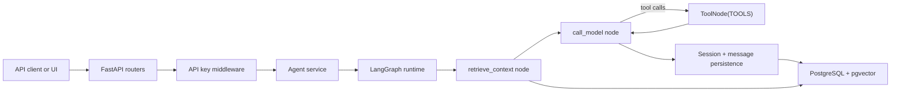

# langgraph-fastapi-starter

[](https://github.com/IgnazioDS/langgraph-fastapi-starter/actions/workflows/ci.yml)
[](https://github.com/IgnazioDS/langgraph-fastapi-starter/releases)

A production-grade backend template for AI agent applications. Fork this, configure
four environment variables, and you have a running agent API with auth, persistence,
and structured logging. Delete the example agent and build yours.

This is not a framework. It is an opinionated starting point that exposes every decision
so you can change the ones you disagree with.

## 10-Minute Path

If you want the fastest credible evaluation path, use this sequence:

1. Clone the repo and bring up Postgres with `make up`
2. Run migrations and create an API key
3. Change the graph in `app/graph/`
4. Send one real request to `/v1/agent/run`
5. Run lint, type-checking, and tests

The full walkthrough lives in [docs/build-your-first-agent.md](./docs/build-your-first-agent.md).

---

## Community Health

If you want to contribute, start with [CONTRIBUTING.md](./CONTRIBUTING.md).
If you need to report a vulnerability, follow [SECURITY.md](./SECURITY.md).
If you are cutting a tag, follow [docs/releasing.md](./docs/releasing.md).

---

## Architecture



The request path is intentionally simple: FastAPI handles transport, middleware enforces
auth, the service layer invokes a small LangGraph loop, and PostgreSQL carries both
application data and vector-backed retrieval.

---

## What It Ships With

| Component | Implementation | Notes |
|-----------|---------------|-------|
| API server | FastAPI | Async, typed, production-ready |
| Agent runtime | LangGraph | Stateful graph execution with checkpointing |
| Vector store | pgvector (PostgreSQL) | Same DB as your app data — no separate service |
| Schema migrations | Alembic | All schema changes versioned and reproducible |
| Auth | API key (Bearer token) | bcrypt-hashed, stored in postgres, revocable |
| Logging | Structured JSON | Request ID propagation, swappable formatter |
| Containerization | Docker Compose | One command to a running local environment |
| Example agent | Research assistant | Web search + document retrieval — delete and replace |

**Not included by design:** Redis, Celery, OAuth, JWT, sessions, file storage, billing,
feature flags, admin UI. Add what your product needs. Don't pay for what it doesn't.

---

## Quickstart

```bash
# 1. Clone and enter
git clone https://github.com/IgnazioDS/langgraph-fastapi-starter
cd langgraph-fastapi-starter

# 2. Create a virtual environment and install dependencies
python3.11 -m venv .venv
source .venv/bin/activate
python -m pip install -e ".[dev]"

# 3. Configure
cp .env.example .env
# Set OPENAI_API_KEY and POSTGRES_PASSWORD in .env — everything else has defaults

# 4. Start the database
make up

# 5. Run migrations and create your first API key
make migrate
make create-key NAME="local-dev"

# 6. Run the server
make dev

# 7. Verify
curl -H "Authorization: Bearer <key-from-step-4>" http://localhost:8000/health
```

The server is running. Send your first agent request:

```bash
curl -X POST http://localhost:8000/v1/agent/run \
  -H "Authorization: Bearer <your-key>" \
  -H "Content-Type: application/json" \
  -d '{"session_id": "demo-1", "message": "What is retrieval-augmented generation?"}'
```

If you prefer `uv`, create the environment with `uv venv --python 3.11` and install
dependencies with `make install-uv`.

---

## Build Your Own Agent

You do not need to understand the whole repository before changing the agent. In most
cases, the first working customization fits inside four files:

- `app/graph/state.py`
- `app/graph/nodes.py`
- `app/graph/tools.py`
- `app/graph/graph.py`

For a concrete clone -> customize -> run -> test walkthrough, see
[docs/build-your-first-agent.md](./docs/build-your-first-agent.md).

---

## What to Change First

The starter ships with a research assistant agent. You will replace it.
These are the four files you touch to build your agent:

**1. `app/graph/state.py`** — Define your agent's state.
The example uses `AgentState` with `messages`, `context`, and `session_id`.
Add fields your agent needs. Remove fields it doesn't.

**2. `app/graph/nodes.py`** — Implement your agent's steps.
Each node is a function: `(state: AgentState) -> AgentState`.
The example ships `retrieve_context`, `generate_response`, and `should_continue`.
Replace these with your logic.

**3. `app/graph/tools.py`** — Define your agent's tools.
The example ships `web_search` (via Tavily) and `retrieve_documents` (via pgvector).
Add tools your agent needs. Remove tools it doesn't use.

**4. `app/graph/graph.py`** — Wire the graph.
Add nodes, define edges, set entry and finish points.
The structure is explicit — no magic routing.

Everything else (auth, logging, database, API endpoints) you leave alone until you
have a reason to change it.

---

## Project Structure

```
langgraph-fastapi-starter/
│
├── app/
│   ├── main.py              # App factory: lifespan, middleware, routers
│   ├── config.py            # All config via environment variables
│   │
│   ├── graph/               # ← YOUR AGENT LIVES HERE
│   │   ├── state.py         # AgentState TypedDict — define your state shape
│   │   ├── nodes.py         # Node functions — define your agent's steps
│   │   ├── tools.py         # LangChain tools — web search, retrieval, custom
│   │   └── graph.py         # Graph assembly — nodes, edges, compilation
│   │
│   ├── routers/
│   │   ├── agents.py        # POST /v1/agent/run, GET /v1/agent/sessions/{id}
│   │   ├── api_keys.py      # POST /v1/keys, DELETE /v1/keys/{id}
│   │   └── health.py        # GET /health, GET /health/detailed
│   │
│   ├── services/
│   │   ├── agent_service.py # Invokes the graph, persists sessions
│   │   └── api_key_service.py # Key creation, validation, revocation
│   │
│   ├── db/
│   │   ├── connection.py    # psycopg2 connection pool
│   │   └── queries.py       # SQL as named constants — no ORM, no magic
│   │
│   ├── middleware/
│   │   ├── auth.py          # API key extraction and validation
│   │   └── logging.py       # Request ID injection, structured access log
│   │
│   └── models/
│       ├── requests.py      # Pydantic request models
│       └── responses.py     # Pydantic response models
│
├── migrations/
│   ├── alembic.ini
│   ├── env.py
│   └── versions/            # 001_initial_schema.py, 002_...
│
├── scripts/
│   ├── create_api_key.py    # python scripts/create_api_key.py --name "..."
│   ├── revoke_api_key.py    # python scripts/revoke_api_key.py --id "..."
│   └── health_check.py      # Exit 0 if healthy, 1 if not
│
├── tests/
│   ├── conftest.py          # Test DB, async client, sample API key
│   ├── test_routers/
│   ├── test_services/
│   └── test_graph/
│
├── CLAUDE.md                # How Claude Code operates in this repo
├── Makefile                 # All supported operations
├── docker-compose.yml       # postgres + pgvector
├── Dockerfile               # Production image
├── pyproject.toml
└── .env.example
```

---

## API Reference

### Run an agent

```http
POST /v1/agent/run
Authorization: Bearer <api-key>

{
  "session_id": "user-123-session-1",   // Persists conversation state
  "message": "Your message here",
  "stream": false                        // true for SSE streaming
}
```

Response:
```json
{
  "session_id": "user-123-session-1",
  "response": "Agent response text",
  "run_id": "run_20260402T143022",
  "usage": { "input_tokens": 142, "output_tokens": 87 }
}
```

### Get session history

```http
GET /v1/agent/sessions/{session_id}
Authorization: Bearer <api-key>
```

### Create an API key

```http
POST /v1/keys
Authorization: Bearer <admin-key>

{ "name": "production-app", "role": "user" }
```

Returns the plaintext key once. Store it. It is not recoverable.

### Revoke an API key

```http
DELETE /v1/keys/{key_id}
Authorization: Bearer <admin-key>
```

### Health check

```http
GET /health           # Liveness: always 200 if server is up
GET /health/detailed  # Readiness: checks database and graph initialization
```

---

## Database Schema

Three tables. That is all the starter adds.

```sql
-- API key management
api_keys (id, key_hash, name, tenant_id, role, created_at, last_used_at, revoked_at)

-- Agent session persistence (LangGraph checkpoint storage)
agent_sessions (id, session_id, tenant_id, created_at, last_active_at, message_count)

-- Message history
agent_messages (id, session_id, role, content, metadata, created_at)
```

pgvector extension is enabled in the initial migration. Add your first vector table
when you need it: `alembic revision -m "add_documents_table"`.

---

## Design Decisions

**1. PostgreSQL as the only datastore.**
A single database for app data, vector storage, session state, and API keys.
No Redis, no separate vector DB. At seed-to-Series-A scale, operational simplicity
beats theoretical performance. If you need Redis later, you'll know why.

**2. Sync database access inside async FastAPI.**
psycopg2 (sync) runs in a thread pool executor. asyncpg would require async migrations,
async connection pooling, and async query interfaces everywhere — too much complexity
for the marginal latency gain at this stage. This is a documented decision, not an oversight.

**3. API key auth only.**
OAuth is a product decision, not an infrastructure decision. The starter gives you
the auth middleware hook. You add the strategy your users need. Bearer tokens work
for every API consumer without a redirect flow.

**4. LangGraph for agent runtime.**
LangGraph handles the parts of agent development that are genuinely hard: state
persistence, conditional branching, tool call cycles, and streaming. It does not hide
these things — it makes them explicit. The graph in `app/graph/graph.py` is readable
by someone who has never used LangGraph.

**5. No streaming by default, SSE as opt-in.**
`"stream": true` in the request body enables Server-Sent Events. The default is a
synchronous response because most API consumers are simpler to build against a
request-response pattern. Add streaming when your UI needs it.

**6. Alembic for all schema changes.**
`CREATE TABLE` in application startup code creates invisible dependencies between
code versions and database state. Alembic migrations are explicit, reversible, and
auditable. The startup sequence never modifies the schema — it only verifies it.

**7. Structured JSON logging from day one.**
grep-based log parsing breaks under load. JSON logs work with every observability
platform (Datadog, CloudWatch, Loki, whatever you use). The formatter is one file.
Replace it when you have an opinion on log aggregation.

---

## Environment Variables

```bash
# Required
OPENAI_API_KEY=sk-...          # Used for LLM calls and embeddings
POSTGRES_PASSWORD=...           # Set anything — used by Docker Compose and the app

# Optional — defaults shown
POSTGRES_HOST=localhost
POSTGRES_PORT=5432
POSTGRES_DB=agentdb
POSTGRES_USER=agent
DATABASE_POOL_SIZE=10
LLM_MODEL=gpt-4o-mini
EMBEDDING_MODEL=text-embedding-3-small
LOG_LEVEL=INFO
LOG_FORMAT=json                 # json | text (text is human-readable for local dev)
TAVILY_API_KEY=...              # Optional: only needed for web search tool
APP_ENV=development             # development | production
```

---

## Extending

### Add a new agent

Create a new graph in `app/graph/`. Register it in `app/graph/__init__.py`.
Add a route in `app/routers/agents.py` that selects the graph by name.
The starter is built to support multiple graphs — it ships with one.

### Add a tool

Add a function decorated with `@tool` to `app/graph/tools.py`.
Import it in `graph.py` and add it to the `tools` list passed to the model.
Tools are plain Python functions. No framework magic.

### Add a database table

```bash
alembic revision -m "add_your_table"
# Edit the generated migration file
alembic upgrade head
```

Add corresponding queries to `app/db/queries.py`.
Add a service function in `app/services/` if the logic is nontrivial.

### Add an endpoint

Add a function to the appropriate router in `app/routers/`.
Add request/response Pydantic models in `app/models/`.
If the logic is more than five lines, put it in `app/services/`.

### Add authentication strategies

The auth middleware is `app/middleware/auth.py`. It extracts and validates
the Bearer token. Replace or extend the validation logic here.
Everything downstream receives a `verified_key: ApiKey` dependency — change
what that object contains and you've changed what auth info is available in routes.

---

## Running in Production

The starter ships a `Dockerfile` for production builds. It is not preconfigured
for any cloud provider because that choice belongs to you.

Key differences between `make dev` and production:

- `make dev` runs Uvicorn with `--reload`. Production runs Gunicorn with Uvicorn workers.
- Production sets `APP_ENV=production`, which disables `/docs` and enforces HTTPS-only cookies.
- Run `alembic upgrade head` as a pre-deploy step, not at application startup.
- The health endpoint at `/health/detailed` is your readiness probe.

```bash
# Production server command
gunicorn app.main:app \
  --workers 4 \
  --worker-class uvicorn.workers.UvicornWorker \
  --bind 0.0.0.0:8000
```

---

## Stack

Python 3.11+ · FastAPI · LangGraph · LangChain · psycopg2 · pgvector · Alembic · Pydantic v2 · Uvicorn · Docker Compose · pytest · httpx · ruff · mypy
